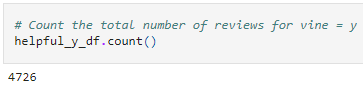
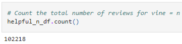
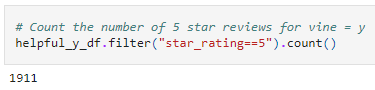
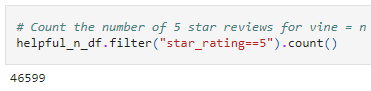
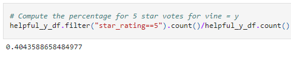
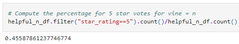

# Amazon Vine Analysis

## Overview of the analysis

This analysis attempts to determine if Vine reviewers increase the number of 5 star reviews for products.

The data set used for the analysis reviews of amazon books.

More information can be found about the Vine program [here](https://www.amazon.com/vine/about).

## Results

The following values were computed from the book revies data set:

* How many Vine reviews and non-Vine reviews were there?

    ### Vine Reviews
    

    ### Non Vine Reviews
    

* How many Vine reviews were 5 stars? How many non-Vine reviews were 5 stars?

    ### Vine Reviews
    

    ### Non Vine Reviews
    

* What percentage of Vine reviews were 5 stars? What percentage of non-Vine reviews were 5 stars?

    ### Vine Reviews
    

    ### Non Vine Reviews
    

## Summary

The vine reviews had about 41% 5-star reviews which is less than 46% 5-star reviews for no vine reviews. This would suggest that vine reviews are not guaranteed to be 5-star reviews. 

The number of sample points may be causing a slight bias. Their were 102,218 non vine and only 4,726 vine reviews. This is factor 21 difference between the population sizes.

I would recommend an additional test of statistical significance be peformed to verify it there is a difference between vine and non vine reviews. 

Another useful analysis would be to sample products and measure the vine vs non vine behavior within the same products. 